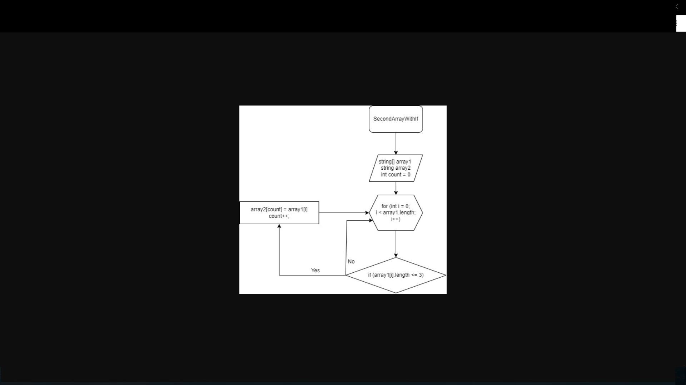

## ***Итоговая проверочная работа.*** ##
___
**Задача:** *Написать программу, которая из имеющегося массива строк формирует новый массив из строк, длина которых меньше, либо равна 3 символам. Первоначальный массив можно ввести с клавиатуры, либо задать на старте выполнения алгоритма. При решении не рекомендуется пользоваться коллекциями, лучше обойтись исключительно массивами.*

***Необходимые условия выполнения:***
___
*1. Создать репозиторий на GitHub.     
2. Нарисовать блок-схему алгоритма (можно обойтись блок-схемой основной содержательной части, если вы выделяете её в отдельный метод)    
3. Снабдить репозиторий оформленным текстовым описанием решения (файл README.md)   
4. Написать программу, решающую поставленную задачу
5. Использовать контроль версий в работе над этим небольшим проектом (не должно быть так, что всё залито одним коммитом, как минимум этапы 2, 3, и 4 должны быть расположены в разных коммитах)*

***Решение:***
___
*1. Был задан массив строк алгоритма запуска, включающий в себя элементы, включенные в требования для проверки задания.  
2. Был создан метод, проверяющий наличие действительных элементов исходного массива по условию с последующим заполнением нового массива достоверными явлениями.  
3. Затем был создан универсальный метод для печати одномерных массивов.  
4. В завершение были распечатаны исходный и массив для тестирования алгоритма работы.  
5. Графическое представление решения предствлено в виде блок-схемы (на псевдокоде).  